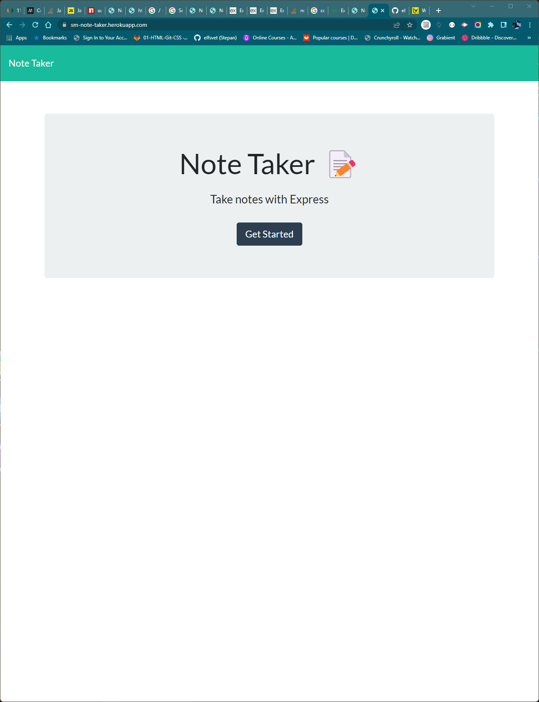

# Stepan Matysik's Note Taker

> Note taker project. A working link with the note taker project.
> Live demo [_here_](https://sm-note-taker.herokuapp.com/). 

## Table of contents
* [General info](#general-info)
* [Technologies](#technologies)
* [Installation](#installation)
* [Instructions](#instructions)
* [Features](#features)
* [Screenshots](#screenshots)
* [Usage](#usage)
* [Project Status](#project-status)
* [Room for Improvement](#room-for-improvement)
* [Acknowledgements](#acknowledgements)
* [Contacts](#contact)


## General Info
This project is a note taker. Uses back end to store variable notes and to do lists.
## Technologies
Project is created with:
- JavaScript
- Node.js
- npm

## Installation
To open this project in vscode using git in Terminal/Git Bash:

```
$ cd in directory there you want to store your project
$ git clone https://github.com/elfsvet/stepan-matysik-note-taker.git
$ code .
```

## Instructions
1. Open the [link](https://sm-note-taker.herokuapp.com/) and click "Get Started".
2. Type in Title and Text of the note.
3. Click on save button if you want to store the note.
4. If you change your mind and didn't store the note. But you want to start another note, click on + button. It will remove previous input.
5. On the left, after you store at least a note, there will be notes.
6. Click a note to see it text and title on the right.
7. If you want to delete a note, simply click a bucket button next to the note.
8. Keep using it 🤪

## Features
- Inquirer package
- Jest package
- Express package
- UUID package

## Screenshots


## Usage
For creating and storing notes.
## Project Status
Project is: _complete_

## Room for Improvement
To do:
- We can add a button to delete all.
- Add ability to edit existing notes.

## Acknowledgements
- This project was inspired by UM Coding Boot Camp
- This project was created with the [starter code](https://github.com/coding-boot-camp/miniature-eureka) provided in Module 11th.


## Contact
Created by [@elfsvet](https://github.com/elfsvet)
- [LinkedIn](https://www.linkedin.com/in/stepanmatysik/)